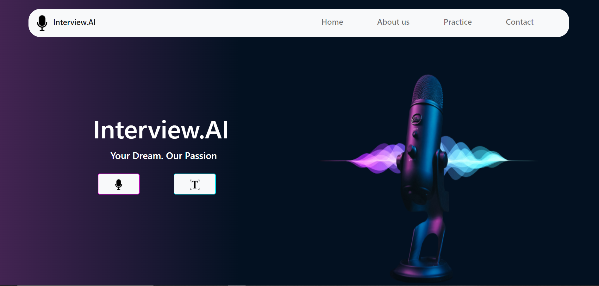

# Emotional-AI-Enabled-Interview-Aid
This repository contains the code for the final year project created as a requirement for B.E Computer Engineering

## Paper
You can find the paper here: [Emotional AI-enabled Interview Aid](https://link.springer.com/chapter/10.1007/978-981-19-7041-2_49)

## Summary
One of the important stages in the life of a student is his or her first job. Naturally, a candidate will
be quite nervous during an interview as it is a completely new experience. Due to such nervousness,
a candidate might be able to speak properly or may not be able to project his/her emotions correctly.
This can have a negative impact on the result of the interview. To avoid this, prior practice is
required. In order to make the candidate become more confident, we propose Emotional AI Enables
Interview Aid, so that a candidate can practice some commonly asked interview questions and
receive concrete feedback based on the response submitted. This will help a candidate become a best
fit for the company.

The system puts forth some common interview questions to the user. The user answers them using his/her speech or text. The system uses the machine learning and deep learning models at the backend to detect the emotions in the input. The analysis of each question is shown to the user. Apart from this, a report of all the questions answered by the user is generated at the end. This report contains the most common emotion displayed by the user throughout the interview along with a comparison chart which shows the performance of the user with other candidates. This comparison will help the user his/her shortcomings and thus, help him/her prepare better for the interview proess.

## Implementation Video:

